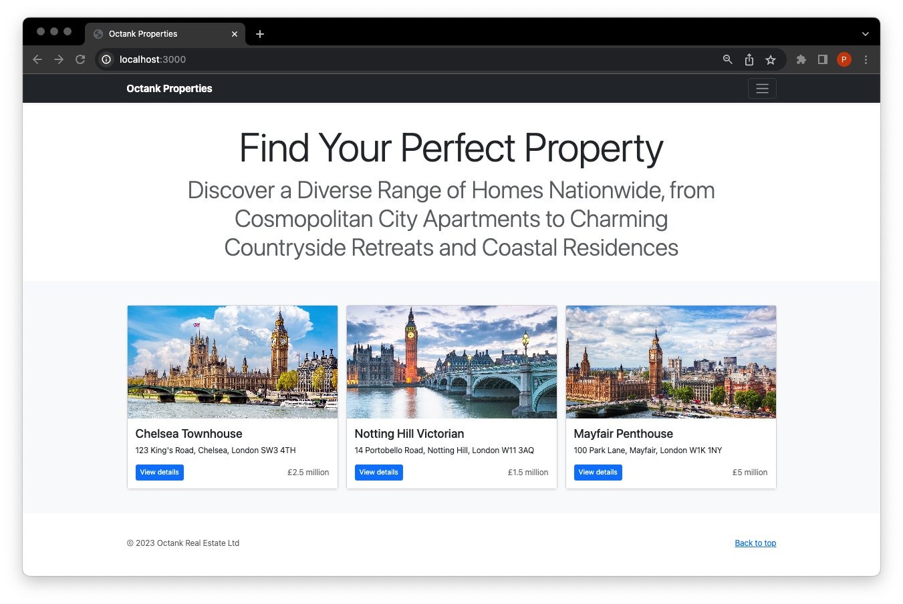

# Octank Nextjs Demo


## Prerequisites
You need Offers API endpoint deployed separately. There is no documentation on how to deploy it yet.

## Website deployment on EC2
User data for EC2:
```bash
#!/bin/bash
sudo yum update -y
sudo yum install -y git nodejs
git -v
node -v  # Check node version
npm -v   # Check npm version

git clone https://github.com/piotrekwitkowski/nextjs-octank-demo.git app
cd app
npm i
NEXT_TELEMETRY_DISABLED=1 npm run build
PORT=80 npm start
```

Useful for cloud init monitoring: 
```bash
tail -f /var/log/cloud-init-output.log
```


## Website deployment on Lambda
Based on https://github.com/sladg/nextjs-lambda
1. Adjust `next.config.js` like described here: https://github.com/sladg/nextjs-lambda#:~:text=next.config.js

1. Install dependencies locally: `npm install`

1. Make sure `node prebuild.js` is included in package.json's prebuild script to fix [this Next bug](https://github.com/vercel/next.js/issues/49169) when app is running in standalone mode 
 
1. Run `next build` (will generate standalone next folder).
1. Run `npx --package @sladg/nextjs-lambda cli pack` (will create ZIPs).
1. Run `npx --package @sladg/nextjs-lambda cli deploy` (will deploy to AWS).
